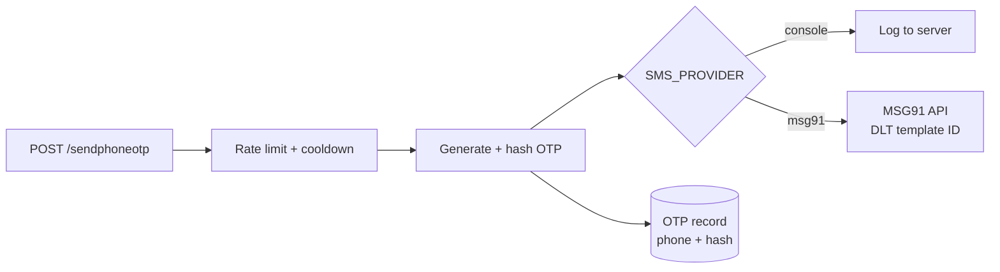

# SMS OTP — Implementation Plan

> As of 2026-09-23. Shared version (for comments):
> https://claude.ai/code/artifact/231649fd-6cf6-4760-9289-e091411acb63

---

## Goal

Add phone-number OTP verification next to the existing email OTP, and keep
costs at zero until launch. Build against a free `console` provider now, then
switch to MSG91 once DLT registration is done.

---

## MSG91 cost

MSG91 has no permanently free SMS tier. Every SMS OTP is billed per message
from a prepaid wallet, and there is no monthly fee.

- **OTP Widget:** free to use, but each OTP it sends is charged by channel
  ([MSG91 OTP Widget pricing](https://msg91.com/in/pricing/otpwidget)).
- **Email OTP via MSG91:** 0.03 INR per message. SMS, voice and WhatsApp follow
  the rate card. Prices exclude 18% GST.
- **Free credits:** third-party listings mention up to 25,000 startup credits.
  These are one-time, not recurring. Confirm with MSG91 at signup.

---

## India DLT registration

You can't send SMS to Indian numbers from any provider without DLT
registration, which costs INR 5,000 + GST on the operator's portal
([MSG91 DLT FAQs](https://msg91.com/help/dlt-registration-in-india/dlt-faqs)).

1. **Entity registration** on one operator's DLT portal (one approval works
   across operators).
2. **Header (sender ID):** 6 letters, matching the company name.
3. **Content template** for the OTP, in the "Service Implicit" category, with
   1–2 variables. The text sent must match the approved template exactly.
4. **PE–TM chain binding** between your entity and MSG91. Without it, messages
   are not delivered.
5. **Map in MSG91:** add the header, entity ID and template ID in the MSG91
   panel ([step-by-step guide](https://msg91.com/help/dlt-registration-in-india/step-by-step-guide-to-implement-dlt-in-sms)).

---

## Options

Only email OTP and a console provider are truly free. Every real SMS route
charges per message.

| Option                                                     | Cost                         | DLT needed by you                     | Notes                                                                           |
| ---------------------------------------------------------- | ---------------------------- | ------------------------------------- | ------------------------------------------------------------------------------- |
| Email OTP (current flow)                                   | Free                         | No                                    | Already in [Auth.js](../server/controllers/Auth.js) through `mailSender` |
| Console provider (dev only)                                | Free                         | No                                    | Logs the OTP on the server; never enable in production                          |
| MSG91 SMS                                                  | Per SMS, rate card + 18% GST | Yes                                   | Full server-side control; reuses the existing OTP model                         |
| MSG91 WhatsApp OTP                                         | Per message, rate card       | No (Meta template approval instead)   | Users need WhatsApp                                                             |
| [Firebase Phone Auth](https://firebase.google.com/pricing) | Per SMS, Blaze plan only     | No (Google sends the SMS; to verify)  | Not on the free Spark plan; verification runs on the client                     |

---

## Recommended approach

Put SMS delivery behind a small provider module, chosen by an `SMS_PROVIDER`
env variable. Build and test the whole flow on `console` now at no cost. Then
switch to `msg91` when DLT is approved.



The OTP stays hashed, expires after 5 minutes and allows 5 attempts, the same
as the email flow in [OTP.js](../server/models/OTP.js). No code changes are
needed to go live, only env variables.

---

## Implementation steps

- [ ] **Provider module** `server/utils/smsSender.js`: `sendSms(phone, otp)`
      with `console` and `msg91` providers, selected by `SMS_PROVIDER`.
- [ ] **OTP model** ([OTP.js](../server/models/OTP.js)): add an optional
      `phone` field (E.164, indexed), and require either `email` or `phone`.
- [ ] **Controller** ([Auth.js](../server/controllers/Auth.js)): add
      `sendPhoneOTP` and `verifyPhoneOTP`, reusing the existing cooldown,
      `hashToken`, `safeCompareHex` and attempt-limit logic from `sendOTP` and
      `signUp`.
- [ ] **Validation** (`server/utils/validateAuth.js`): normalise and validate
      Indian mobile numbers (+91, 10 digits).
- [ ] **Routes** ([User.js](../server/routes/User.js)): `POST /sendphoneotp`
      and `POST /verifyphoneotp`, each behind a per-IP and per-number rate
      limiter, like `/sendotp`.
- [ ] **Profile:** save the verified number to `Profile.contactNumber` with a
      `phoneVerified` flag.
- [ ] **Env:** `SMS_PROVIDER`, `MSG91_AUTH_KEY`, `MSG91_TEMPLATE_ID`, in
      `.env.example`.
- [ ] **Frontend:** phone input + OTP entry screen, with a 60-second resend
      timer.
- [ ] **Go live:** finish DLT registration, map the header and template in
      MSG91, set `SMS_PROVIDER=msg91`.

---

## WhatsApp OTP

WhatsApp OTP avoids DLT entirely, but it requires Meta business verification
and only reaches users who have WhatsApp. It's a good fallback or a primary
channel alongside SMS.

- **Pricing:** since 1 July 2025, Meta charges per message, and
  "authentication" messages have their own rate
  ([Meta WhatsApp pricing](https://developers.facebook.com/docs/whatsapp/pricing)).
  MSG91 bills WhatsApp per its rate card, plus 18% GST
  ([MSG91 WhatsApp pricing](https://msg91.com/in/pricing/whatsapp)).
- **Setup:** a WhatsApp Business account connected through MSG91, a verified
  business on Meta, and an approved authentication template (the code plus an
  optional copy-code button).
- **In code:** a third provider, `msg91-whatsapp`, in `smsSender.js`. The OTP
  model and controller stay unchanged.
- **Trade-off:** usually cheaper than SMS and better delivered, but users
  without WhatsApp still need SMS or email as a fallback.

---

## MSG91 API code

The MSG91 provider calls the v5 Flow API, the DLT-compliant route for Indian
numbers ([MSG91 Flow API](https://api.msg91.com/apidoc/textsms/send-sms-flow.php)).
It uses Node 20's built-in `fetch`, so no new dependency is needed.

```js
// server/utils/smsSender.js
const MSG91_FLOW_URL = "https://control.msg91.com/api/v5/flow";

const providers = {
    // Dev only: prints the code instead of sending it.
    console: async (phone, otp) => {
        console.log(`[sms:console] OTP for ${phone}: ${otp}`);
    },

    msg91: async (phone, otp) => {
        const res = await fetch(MSG91_FLOW_URL, {
            method: "POST",
            headers: {
                authkey: process.env.MSG91_AUTH_KEY,
                "content-type": "application/json",
            },
            body: JSON.stringify({
                template_id: process.env.MSG91_TEMPLATE_ID,
                short_url: "0",
                // `phone` is E.164 without the plus, e.g. 919876543210.
                // `otp` must match the variable name in the DLT template.
                recipients: [{ mobiles: phone, otp }],
            }),
        });
        const data = await res.json().catch(() => ({}));
        if (!res.ok || data.type === "error") {
            throw new Error(`MSG91 send failed: ${data.message || res.status}`);
        }
    },
};

exports.sendSms = async (phone, otp) => {
    const name = process.env.SMS_PROVIDER || "console";
    if (name === "console" && process.env.NODE_ENV === "production") {
        throw new Error("SMS_PROVIDER=console is not allowed in production");
    }
    const provider = providers[name];
    if (!provider) throw new Error(`Unknown SMS_PROVIDER: ${name}`);
    await provider(phone, otp);
};
```

**Env variables** (`.env.example`):

```bash
SMS_PROVIDER=console          # console | msg91
MSG91_AUTH_KEY=
MSG91_TEMPLATE_ID=            # MSG91 template mapped to the DLT template
```

The sender ID and DLT entity ID are mapped to the template in the MSG91 panel,
so the request doesn't send them. The controller calls `sendSms` where
`sendOTP` currently calls `mailSender`, and deletes the OTP record if sending
throws.

---

## Cost estimates

Going live costs about ₹7,375 upfront: ₹5,900 for DLT (₹5,000 + 18% GST) plus
₹1,475 for the smallest 5,000-SMS pack. After that, 2,000 signups a month cost
about ₹708.

| Signups / month | SMS / month (×1.2 for resends) | Rate (₹/SMS, pack tier) | Monthly cost incl. 18% GST (₹) |
| --------------- | ------------------------------ | ----------------------- | ------------------------------ |
| 500             | 600                            | 0.25                    | 177                            |
| 2,000           | 2,400                          | 0.25                    | 708                            |
| 10,000          | 12,000                         | 0.20                    | 2,832                          |
| 50,000          | 60,000                         | 0.17                    | 12,036                         |

Rates come from MSG91's India SMS packs, prepaid from ₹0.25 down to ₹0.16 per
SMS, with up to ₹0.13 for enterprise deals
([MSG91 SMS pricing](https://msg91.com/in/pricing/sms)). The 1.2× resend factor
is an assumption. Email OTP stays free as a fallback.

---

## Open decisions

- [ ] Where is phone OTP used: signup verification, passwordless login, or both?
- [ ] Is phone optional or required at signup?
- [ ] Is the business entity ready for DLT registration (GST or other business
      documents)?

---

## Sources

- [MSG91 OTP Widget pricing](https://msg91.com/in/pricing/otpwidget)
- [MSG91 DLT FAQs](https://msg91.com/help/dlt-registration-in-india/dlt-faqs)
- [MSG91 step-by-step DLT guide](https://msg91.com/help/dlt-registration-in-india/step-by-step-guide-to-implement-dlt-in-sms)
- [Firebase pricing](https://firebase.google.com/pricing)
- [MSG91 SMS pricing (India)](https://msg91.com/in/pricing/sms)
- [MSG91 WhatsApp pricing](https://msg91.com/in/pricing/whatsapp)
- [MSG91 Flow API](https://api.msg91.com/apidoc/textsms/send-sms-flow.php)
- [Meta WhatsApp pricing](https://developers.facebook.com/docs/whatsapp/pricing)
